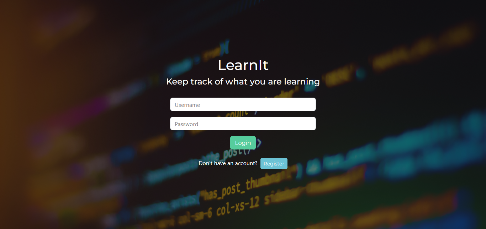
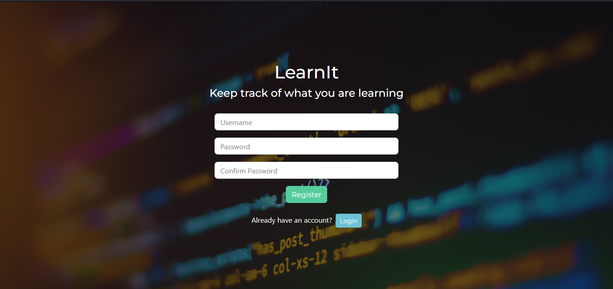
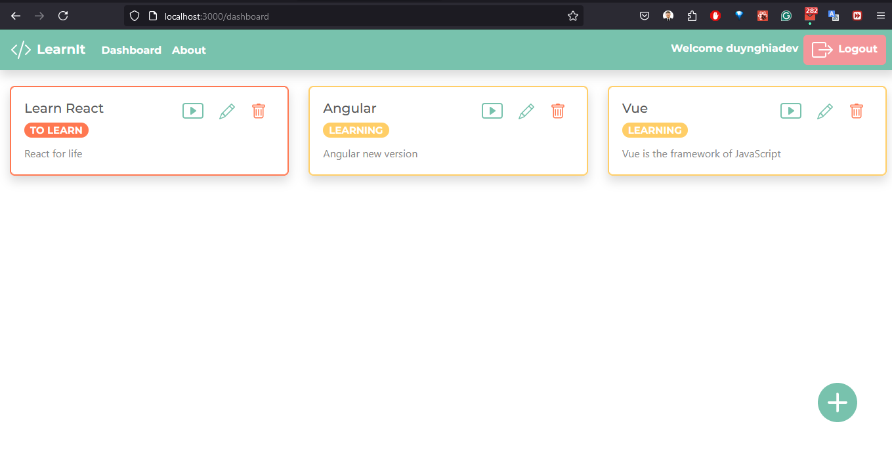
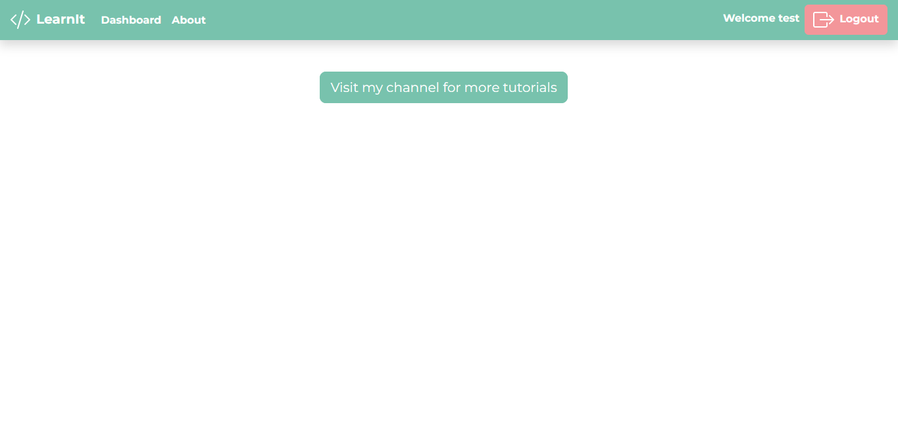
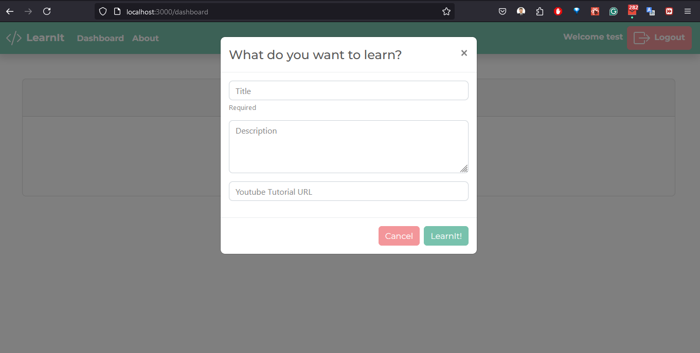
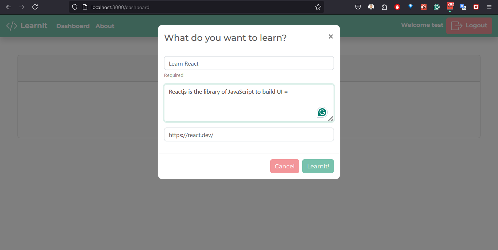
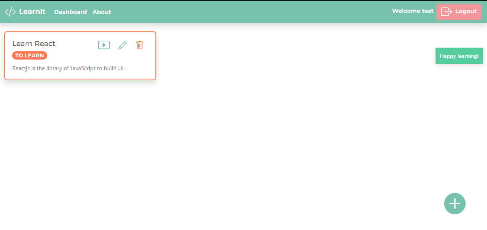

# MERN Tutorial - LearnIt

Welcome to the MERN Tutorial - LearnIt project! This repository contains the source code for a MERN stack application that demonstrates how to build a full-stack web application using MongoDB, Express, React, and Node.js.

1. client

✔ [Link deployed](https://mern-stack-learnit.netlify.app)

✔ [Wesite netlify](https://app.netlify.com/sites/mern-stack-learnit/overview)

2. server

✔ [Link server](https://mern-stack-snowy.vercel.app/api/posts)

✔ [Website Vercel](https://vercel.com/duynghiadevs-projects/mern-stack)

## Table of Contents

- [Introduction](#introduction)
- [Website Images](#website-images)
- [Features](#features)
- [Technologies Used](#technologies-used)
- [Installation](#installation)
- [Usage](#usage)
- [Contributing](#contributing)
- [License](#license)

## Introduction

LearnIt is a simple learning platform built using the MERN stack. It aims to provide a foundational understanding of how to integrate MongoDB, Express, React, and Node.js to create a modern web application. This tutorial is perfect for beginners who want to get started with the MERN stack.

## Website Images

## Login



## Register



## Dashboard

For users who already have an account, this is the dashboard page after logging in, showing all the courses they are enrolled in.



For new users who haven't created any courses yet, the site will display information like this.


## About Page

The About page doesn't have much, just a button that redirects to another link when clicked.



## Creating a Course

These are the steps to create a course.





## Features

- User authentication and authorization
- Create, read, update, and delete (CRUD) operations for learning resources
- Responsive design
- JWT-based authentication
- Environment configuration using dotenv

## Technologies Used

- **MongoDB**: NoSQL database for storing application data
- **Express**: Web framework for Node.js
- **React**: Front-end library for building user interfaces
- **Node.js**: JavaScript runtime for server-side programming
- **argon2**: Library for hashing passwords
- **cors**: Middleware for enabling CORS
- **dotenv**: Module for loading environment variables
- **jsonwebtoken**: Library for working with JSON Web Tokens
- **mongoose**: ODM for MongoDB
- **nodemon**: Tool for automatically restarting the node application when file changes are detected

## Installation

Follow these steps to set up the project on your local machine:

1. Clone the repository:

   ```sh
   git clone https://github.com/duynghiadev/MERN-Stack
   cd mern-stack
   ```

2. Install the dependencies:

   ```sh
   npm install argon2@^0.27.1 cors@^2.8.5 dotenv@^8.2.0 express@^4.17.1 jsonwebtoken@^8.5.1 mongoose@^5.12.2 nodemon@^2.0.7 --save-dev
   ```

3. Set up environment variables:

   Create a `.env` file in the root directory and add the following environment variables:

   ```env
   PORT=5000
   MONGODB_URI=your_mongodb_uri
   JWT_SECRET=your_jwt_secret
   ```

## Usage

1. Start the backend server:

   ```sh
   npm run server
   ```

2. Start the frontend development server:

   ```sh
   npm run client
   ```

3. Open your browser and navigate to `http://localhost:3000` to see the application in action.

## Contributing

Contributions are welcome! If you have any suggestions or improvements, feel free to open an issue or submit a pull request.
